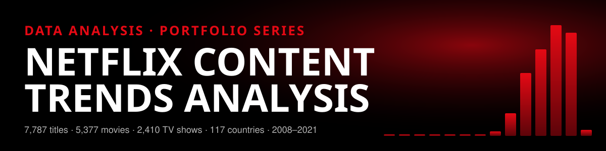
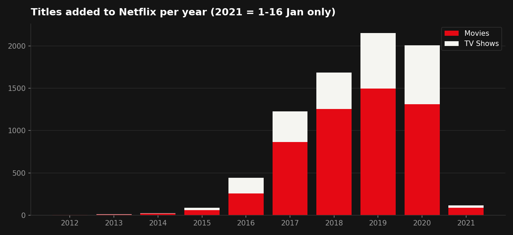
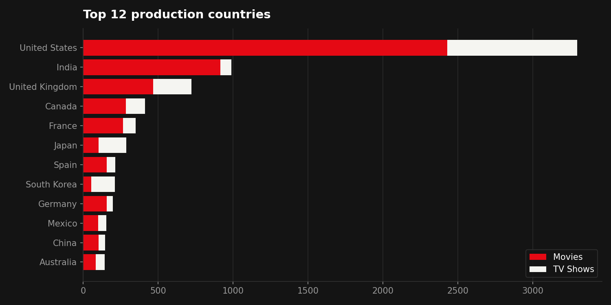

<div align="center">

[](#)
[](#)
[](#)
[](#)
[](https://fowziafaria1234-ops.github.io/netflix-content-trends-analysis/dashboard/)
</div>

## 🎬 Project overview

An analysis of **7,787 titles** from the public Netflix catalogue extract, looking at how the catalogue grew, which genres and countries lead, how content is rated and how long it runs. Raw data is cleaned and feature-engineered in Python, reconciled with unit tests and published as an interactive, Netflix-themed dashboard.

### 👉 [Open the live dashboard](https://fowziafaria1234-ops.github.io/netflix-content-trends-analysis/dashboard/)

> **Data source:** [Netflix Movies and TV Shows](https://www.kaggle.com/datasets/shivamb/netflix-shows) by Shivam Bansal (Kaggle), a catalogue snapshot collected via Flixable up to **16 Jan 2021**. This is real, public data, not synthetic. Independent portfolio project, not affiliated with Netflix.

## 📌 Key results

| Metric | Result |
|---|---:|
| Titles analysed | **7,787** (5,377 movies · 2,410 TV shows) |
| Movie share of catalogue | **69.1%** |
| Titles added 2016–2020 | **7,515 (96.6%)** |
| Peak year for additions | **2019** (2,153 titles) |
| TV share of additions, 2018 → 2020 | **25.5% → 34.7%** |
| Production countries | **117** |
| Median movie runtime | **98 min** |
| TV shows with one season | **66.7%** |
| Adult-rated titles (TV-MA / R / NC-17) | **45.3%** |

## 💡 Insights

1. **Rapid build-out, then a plateau.** Additions grew 403.4% in 2016 and peaked at 2,153 in 2019; 2020 was the first decline (-6.7%).
2. **A shift towards TV.** TV shows rose from 25.5% of new additions in 2018 to 34.7% in 2020.
3. **International first.** “International Movies” is the #1 genre label (2,437 titles), and India (990) is second only to the United States (3,297).
4. **Trial many series.** 66.7% of TV shows have a single season.
5. **A recent catalogue.** 70.0% of titles were released in 2015 or later.




## 🧭 Analytics workflow

| Step | What happens | Script |
|---|---|---|
| 1. Audit | Missing values measured on the raw file before any change | `src/clean_transform.py` |
| 2. Clean | Whitespace trimmed, dates parsed, missing country/director labelled `Unknown` | `src/clean_transform.py` |
| 3. Engineer | Runtime → minutes / seasons, ratings → audience bands, genres & countries exploded | `src/clean_transform.py` |
| 4. Aggregate | Yearly, YoY, genre, country, rating and runtime metrics | `src/build_metrics.py` |
| 5. Visualise | Static Matplotlib charts + self-contained HTML dashboard | `src/create_visuals.py`, `src/build_dashboard.py` |
| 6. Test | Every total reconciled back to the raw row count | `tests/test_metrics.py` |

## 🧹 Data quality

| Column | Missing | % |
|---|---:|---:|
| director | 2,389 | 30.7 |
| cast | 718 | 9.2 |
| country | 507 | 6.5 |
| date_added | 10 | 0.1 |
| rating | 7 | 0.1 |

No duplicate `show_id`s. Missing values are labelled and excluded from rankings rather than guessed. See [DATA_DICTIONARY.md](DATA_DICTIONARY.md) and [docs/PROJECT_REPORT.md](docs/PROJECT_REPORT.md).

**Caveats:** this is a snapshot of titles available on 16 Jan 2021; titles removed earlier are not included, so early years are undercounted. 2021 covers 1–16 January only.

## 🖥️ Dashboard features

- Netflix-style billboard with auto-playing key insights
- Top 10 genres row (All / Movies / TV Shows)
- Interactive charts with tooltips; click a bar to browse the matching titles
- Search, filter and sort all 7,787 titles, with a detail view for each
- Works on mobile, has no external dependencies and makes no network calls, so it keeps working long-term on GitHub Pages

## ▶️ Reproduce

```bash
pip install -r requirements.txt
python src/run_pipeline.py     # rebuilds data/processed, assets and dashboard/index.html
pytest -q                      # reconciliation tests
```

## 📁 Structure

```
data/raw/netflix_titles.csv        source extract (7,787 rows)
data/processed/                    cleaned table, exploded genres/countries, KPIs, quality audit
src/                               pipeline scripts + dashboard template
dashboard/index.html               published dashboard (single self-contained file)
assets/                            report charts
tests/                             reconciliation tests
docs/PROJECT_REPORT.md             write-up
```

---
**Faria Islam** · Junior Data Analyst · [Portfolio](https://fowziafaria1234-ops.github.io/fowziafaria1234-ops/) · [LinkedIn](https://www.linkedin.com/in/faria-islam-1a2338349)
